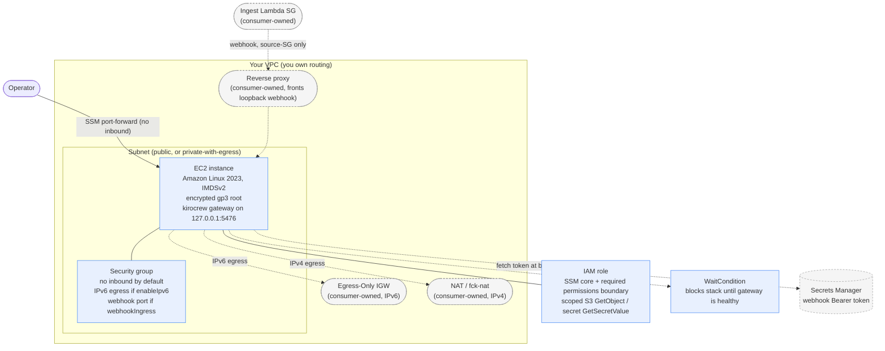
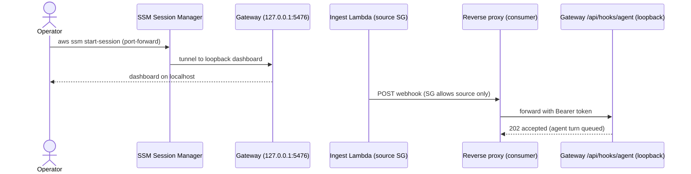

# @raindancers/raindancers-crew

A CDK construct that provisions a **self-hosted [KiroCrew](https://github.com/kirodotdev/KiroCrew) gateway** on a single EC2 instance in your own AWS account, reached over **SSM Session Manager** — no inbound ports, no SSH key.

It is a pipeline-native, version-controlled port of the upstream `kirocrew-ec2` CloudFormation template. Where the native `kirocrew cloud launch` is an imperative one-shot, this construct lets you deploy the same shape **through your own CDK pipeline**, under **your** naming, permissions boundary, and OIDC deploy role — so a remote crew becomes a reviewed, repeatable, diffable artifact like everything else you ship.

## Architecture

What `RemoteCrewInstance` creates (solid) and what your VPC/app owns (dashed). The default is the SSM-only public-subnet box; the IPv6 egress and webhook ingress are opt-in props.



## Getting started

### 1. Install

```bash
npm install @raindancers/raindancers-crew
```

The package targets `aws-cdk-lib` ^2.260.0 and `constructs` ^10 (peer dependencies — your app supplies them).

### 2. Define a stack

A complete stack that stands up an EC2 crew with off-box backup. Everything is
typed and compiles as-is — fill in your account, region, VPC lookup, and
permissions-boundary ARN.

```ts
import { App, Stack, StackProps } from 'aws-cdk-lib';
import * as ec2 from 'aws-cdk-lib/aws-ec2';
import { Construct } from 'constructs';
import {
  RemoteCrewInstance,
  CrewArchitecture,
  CrewBackupBucket,
} from '@raindancers/raindancers-crew';

class CrewStack extends Stack {
  constructor(scope: Construct, id: string, props: StackProps) {
    super(scope, id, props);

    // Your existing VPC (or ec2.Vpc.fromLookup(...)).
    const vpc = ec2.Vpc.fromLookup(this, 'Vpc', { isDefault: true });

    // Durable, versioned, KMS-encrypted backup destination.
    const backup = new CrewBackupBucket(this, 'CrewBackup');

    new RemoteCrewInstance(this, 'Crew', {
      vpc,
      // REQUIRED: the instance runs a prompt-injectable agent, so its role
      // must be capped by a permissions boundary you pre-create.
      permissionsBoundaryArn:
        'arn:aws:iam::123456789012:policy/kirocrew-ec2-boundary',
      architecture: CrewArchitecture.ARM64,
      instanceType: new ec2.InstanceType('m7g.2xlarge'),
      // Pin a released tag for reproducible deploys — the default `main` drifts.
      source: { kirocrewRef: 'v0.8.0' },
      // Off-box backup: grants scoped write + installs a daily snapshot timer.
      backupBucket: backup,
      backupSchedule: 'daily',
    });
  }
}

const app = new App();
new CrewStack(app, 'RemoteCrew', {
  env: { account: '123456789012', region: 'eu-west-2' },
});
app.synth();
```

### 3. Deploy through your pipeline

This is a plain CDK stack — deploy it however you deploy everything else
(a CDK Pipelines / agentl stage, or `cdk deploy` from a keyless-OIDC CI job).
The `WaitCondition` blocks stack completion until the gateway is actually
serving, so a green deploy means a live crew (and a failed bootstrap rolls the
stack back with the setup-log tail in the failure reason).

```bash
cdk deploy RemoteCrew
```

### 4. Connect

Access is **SSM-only** — no inbound ports. Open a port-forward to the
loopback dashboard and browse `http://127.0.0.1:5476`:

```bash
# The construct exports the instance id under a stable name derived from the
# stackTag (default 'kirocrew'): kirocrew-<stackTag>-instance-id
INSTANCE_ID=$(aws cloudformation list-exports \
  --query "Exports[?Name=='kirocrew-kirocrew-instance-id'].Value" --output text)

aws ssm start-session --target "$INSTANCE_ID" \
  --document-name AWS-StartPortForwardingSession \
  --parameters '{"portNumber":["5476"],"localPortNumber":["5476"]}'
```

(Or use the upstream `kirocrew cloud connect`, which mints the dashboard token
on the box and opens the tunnel for you.)

### 5. Verify backup

The daily timer pushes a redaction-scrubbed snapshot to the backup bucket. Fire
one immediately and confirm it landed:

```bash
# On the instance (via SSM Session Manager):
sudo systemctl start kirocrew-backup.service
sudo journalctl -u kirocrew-backup.service --no-pager | tail

# From your workstation — the stable key a replacement instance restores from:
aws s3 ls "s3://<backup-bucket>/crew-snapshots/latest.tar"
```

To rebuild a **replacement** instance from backup, deploy a fresh `CrewStack`
pointing at the same bucket, then on the new box run
`sudo kirocrew-restore-from-s3` (pulls `latest.tar`, stops the gateway,
restores in replace mode, restarts).

> **Container crew instead of an instance?** See [Fargate lane](#fargate-lane)
> below — swap `RemoteCrewInstance` for `FargateCrewBase` + `FargateCrew`.

The sections below are the per-construct reference.

## What it creates

| Resource | Notes |
|---|---|
| IAM role + instance profile | `AmazonSSMManagedInstanceCore` + a **required permissions boundary**; scoped `s3:GetObject` only when an S3 source is used |
| Security group | **No inbound** by default (SSM-only); optional `tcp/22` from `allowSshCidr` (≤ /16); optional webhook port from a single source SG via `webhookIngress`; IPv6 egress when `enableIpv6` |
| EC2 instance | Amazon Linux 2023, arch-aware AMI, **IMDSv2 enforced**, **encrypted gp3** root |
| WaitConditionHandle + WaitCondition | Blocks stack completion until the gateway is actually serving on the loopback dashboard port |

## Security posture (preserved from upstream)

- **SSM-only access.** No inbound rules unless you explicitly pass `allowSshCidr`. Access is via SSM port-forward; the public DNS is diagnostics only.
- **IMDSv2 required, hop limit 1.** KiroCrew runs a prompt-injectable agent that executes arbitrary tools — an SSRF/injection reaching the metadata endpoint must not be able to read the role's STS credentials via IMDSv1.
- **Permissions boundary is mandatory** on the instance role.
- **Node.js tarball is SHA-256-pinned** and verified before root extraction.
- **Encrypted EBS root.**

## Private dual-stack brain (55minutes posture)

For an always-on brain that egresses over IPv6 with **no public IPv4**, is woken
by the native KiroCrew webhook, and runs as an autopilot crew that never
idle-closes, compose the additive props below. Everything here is optional and
defaults off — omit it all and you get the SSM-only public-subnet box above.

```ts
import * as ec2 from 'aws-cdk-lib/aws-ec2';
import { RemoteCrewInstance, CrewArchitecture } from '@raindancers/raindancers-crew';

// vpc: a dual-stack VPC whose private subnets carry IPv6 CIDRs and route
//      ::/0 to an Egress-Only Internet Gateway (see "What stays yours" below).
// ingestLambdaSg: the SG of the consumer's ingest Lambda / reverse proxy —
//      imported, this construct never creates it.
new RemoteCrewInstance(this, 'Brain', {
  vpc,
  permissionsBoundaryArn:
    'arn:aws:iam::123456789012:policy/kirocrew-ec2-boundary',
  architecture: CrewArchitecture.ARM64,
  source: { kirocrewRef: 'v0.8.0' },

  // Private + dual-stack: IPv6 egress, no public IPv4.
  vpcSubnets: { subnetType: ec2.SubnetType.PRIVATE_WITH_EGRESS },
  associatePublicIp: false,
  enableIpv6: true,

  // Webhook reach from ONE source SG only (never a CIDR), authenticated by a
  // Bearer token fetched from Secrets Manager at boot (written to config.json
  // as hooks.webhook_token; the instance role gets GetSecretValue on this ARN).
  webhookIngress: { source: ingestLambdaSg },
  webhookTokenSecretArn:
    'arn:aws:secretsmanager:eu-west-2:123456789012:secret:kc/webhook-token-AbCdEf',

  // Always-on: autopilot + never idle-close.
  crewRuntime: { autopilot: true, disableIdleClose: true },
});
```

### What stays yours (this construct provisions none of it)

`RemoteCrewInstance` consumes an `IVpc` and provisions no routing, so these live
in your VPC / app, not the library:

- **Egress-Only Internet Gateway** and the `::/0` IPv6 egress route — the VPC's
  concern. `enableIpv6` assigns the instance an IPv6 address and opens IPv6
  egress on its SG, but the route to the internet is yours.
- **fck-nat (or managed NAT)** for any IPv4 egress you still need.
- **The ingest Lambda and its security group** — you build it and pass its SG as
  `webhookIngress.source`. The construct only accepts it.
- **Routable exposure of the webhook.** The KiroCrew gateway binds `127.0.0.1`
  only (it has no routable listener), so `webhookIngress` opens the SG but a
  **consumer-owned reverse proxy or SSH tunnel on the box** is what actually
  forwards `POST /api/hooks/agent` from the source SG to the loopback gateway.
  The dashboard stays loopback/SSM-only regardless.

## Examples

Worked implementations for the common shapes. Each is a complete construct
instantiation against the real props — fill in your account, region, VPC, and
permissions-boundary ARN.

### 1. Minimal SSM-only crew (the simplest thing that works)

A single crew box in a public subnet, reached only over SSM. No backup, no
webhook, defaults everywhere.

```ts
import * as ec2 from 'aws-cdk-lib/aws-ec2';
import { RemoteCrewInstance } from '@raindancers/raindancers-crew';

const vpc = ec2.Vpc.fromLookup(this, 'Vpc', { isDefault: true });

new RemoteCrewInstance(this, 'Crew', {
  vpc,
  permissionsBoundaryArn:
    'arn:aws:iam::123456789012:policy/kirocrew-ec2-boundary',
  // Pin a released tag for reproducible deploys — the default `main` drifts.
  source: { kirocrewRef: 'v0.8.0' },
});
```

### 2. Crew with off-box backup

Add a hardened, versioned, KMS-encrypted backup bucket; the construct grants the
instance role write + read and installs a daily snapshot timer.

```ts
import * as ec2 from 'aws-cdk-lib/aws-ec2';
import {
  RemoteCrewInstance,
  CrewBackupBucket,
  CrewArchitecture,
} from '@raindancers/raindancers-crew';

const vpc = ec2.Vpc.fromLookup(this, 'Vpc', { isDefault: true });
const backup = new CrewBackupBucket(this, 'CrewBackup');

new RemoteCrewInstance(this, 'Crew', {
  vpc,
  permissionsBoundaryArn:
    'arn:aws:iam::123456789012:policy/kirocrew-ec2-boundary',
  architecture: CrewArchitecture.ARM64,
  instanceType: new ec2.InstanceType('m7g.2xlarge'),
  source: { kirocrewRef: 'v0.8.0' },
  backupBucket: backup,
  backupSchedule: 'daily',           // systemd OnCalendar expression
  backupPrefix: 'crew-snapshots/',
});
```

### 3. Source from an S3 tarball instead of a git clone

For air-gapped or pinned-artifact deploys: the instance role is granted
`s3:GetObject` on exactly that one object, nothing wider.

```ts
new RemoteCrewInstance(this, 'Crew', {
  vpc,
  permissionsBoundaryArn:
    'arn:aws:iam::123456789012:policy/kirocrew-ec2-boundary',
  source: {
    sourceBucket: 'my-artifacts-bucket',
    sourceKey: 'kirocrew/kirocrew-src-v0.8.0.tar.gz',
  },
});
```

### 4. Private dual-stack always-on brain (the full 55minutes posture)

Private subnet, IPv6 egress, no public IPv4, webhook reachable from one source
SG, authenticated by a Secrets Manager token, running as an autopilot crew that
never idle-closes. See [Private dual-stack brain](#private-dual-stack-brain-55minutes-posture)
above for the prop-by-prop walkthrough.

```ts
import * as ec2 from 'aws-cdk-lib/aws-ec2';
import { RemoteCrewInstance, CrewArchitecture } from '@raindancers/raindancers-crew';

// ingestLambdaSg: the SG of your ingest Lambda / reverse proxy — imported.
new RemoteCrewInstance(this, 'Brain', {
  vpc,
  permissionsBoundaryArn:
    'arn:aws:iam::123456789012:policy/kirocrew-ec2-boundary',
  architecture: CrewArchitecture.ARM64,
  source: { kirocrewRef: 'v0.8.0' },

  vpcSubnets: { subnetType: ec2.SubnetType.PRIVATE_WITH_EGRESS },
  associatePublicIp: false,
  enableIpv6: true,

  webhookIngress: { source: ingestLambdaSg },
  webhookTokenSecretArn:
    'arn:aws:secretsmanager:eu-west-2:123456789012:secret:kc/webhook-token-AbCdEf',

  crewRuntime: { autopilot: true, disableIdleClose: true },
});
```

### 5. Fargate lane — shared base + one crew

For a container-based crew: `FargateCrewBase` once per account/region (the ECS
cluster + egress-only SG), then one `FargateCrew` per crew (its two roles + log
group). Deleting a crew never touches the shared cluster.

```ts
import * as ec2 from 'aws-cdk-lib/aws-ec2';
import {
  FargateCrewBase,
  FargateCrew,
  FargateCpuArchitecture,
  CrewBackupBucket,
} from '@raindancers/raindancers-crew';

const vpc = ec2.Vpc.fromLookup(this, 'Vpc', { isDefault: true });
const backup = new CrewBackupBucket(this, 'CrewBackup');

// One per account/region — the shared cluster + egress-only task SG.
const base = new FargateCrewBase(this, 'CrewBase', {
  vpc,
  cpuArchitecture: FargateCpuArchitecture.ARM64,
});

// One per crew — roles + log group. Task role gets the backup write grant
// (the running container pushes snapshots), NEVER a secret-read grant.
const crew = new FargateCrew(this, 'ResearchCrew', {
  crew: 'research',
  logRetentionDays: 30,
  permissionsBoundaryArn:
    'arn:aws:iam::123456789012:policy/kirocrew-crew-boundary',
  backupBucket: backup,
});

// base.cluster, base.securityGroup, crew.executionRole, crew.taskRole,
// crew.logGroup, crew.secretNamePrefix are exposed for your RunTask launch spec.
```

### Access + webhook flow

How the crew is reached — SSM for the operator, the source-SG + reverse proxy
for the native webhook. Nothing dials the box directly.



## Connecting

`RemoteCrewInstance` provisions the box; **connection stays an operator action** (it is inherently imperative — mint a short-lived token on the instance and open an SSM port-forward). Use the upstream `kirocrew cloud connect` against the deployed instance id, or your own SSM `start-session` / port-forward wrapper.

## Fargate lane

For a container-based crew there are two sibling constructs, mirroring the upstream `kirocrew-fargate-base` + `kirocrew-fargate-crew` split:

- **`FargateCrewBase`** — one per account/region: the ECS cluster crew tasks run on plus an egress-only (no-inbound) task security group. Deleting a crew must not delete the shared cluster, so this is separate.
- **`FargateCrew`** — one per crew: the execution role (secret read scoped to `kirocrew/crew/<crew>/*`, log write, optional private-ECR pull), the **zero-policy task role** (the running container's blast radius — it must never gain `secretsmanager:GetSecretValue`), and the crew's log group. All names are derived from the crew name.

```ts
import { FargateCrewBase, FargateCrew } from '@raindancers/raindancers-crew';

const base = new FargateCrewBase(this, 'CrewBase', { vpc });
new FargateCrew(this, 'Crew', {
  crew: 'fiftyfive',
  // permissionsBoundaryArn: '...',  // optional until the shared boundary creator lands
  // ecrRepositoryArn: '...',        // only for a private image; public registry needs no grant
});
```

Security invariants preserved from upstream: task role has no policies and never reads secrets; execution-role secret read is crew-scoped with individually-listed actions (no prefix wildcards); both assume-role trusts carry an `aws:SourceAccount` condition. The permissions boundary is **optional** here (a declared degraded mode) because no creator for the crew boundary exists yet — unlike the EC2 lane, where it is mandatory.

**EC2 vs Fargate:** EC2 gives a persistent box with local disk (the crew's memory/knowledge DBs live on the instance) and is the native launcher's default; Fargate is more ephemeral and expects external persistence. For a remote crew that remembers across sessions, EC2 is usually the better fit.

## Backing up the crew's learnings

A remote crew's value is its accumulated memory, lessons, and knowledge — which on the EC2 lane live on the instance's local disk. KiroCrew's built-in backup (`kirocrew snapshot`) produces a redaction-scrubbed bundle (the signing key, `.env`, and execution logs never ship), but writes it **locally** — so it survives corruption, not instance loss. These constructs add the missing **off-box durability**.

`CrewBackupBucket` provisions a hardened destination: SSE-KMS (rotating key), all public access blocked, TLS-only, **versioned**, with a lifecycle rule expiring stale noncurrent versions. Bucket and key `RETAIN` on stack delete, so the backups outlive a teardown.

```ts
import { CrewBackupBucket, RemoteCrewInstance } from '@raindancers/raindancers-crew';

const backup = new CrewBackupBucket(this, 'CrewBackup');

new RemoteCrewInstance(this, 'Crew', {
  vpc,
  permissionsBoundaryArn: '...',
  backupBucket: backup,          // grants scoped write + installs a daily timer
  backupSchedule: 'daily',       // systemd OnCalendar
});
```

On the **EC2 lane** this grants the instance role scoped write, installs a **systemd timer** that runs `kirocrew snapshot --purpose backup` and uploads the newest bundle to S3 (a timestamped key for history plus a stable `latest.tar`), and installs a `kirocrew-restore-from-s3` helper. On the **Fargate lane**, pass the same bucket to `FargateCrew` — it grants the **task role** (the running container) write, since the container runs its own snapshot push.

### Restore (rebuilding a replacement crew)

`kirocrew restore <bundle> --mode replace|merge`:

- **replace** clears the target's memory/knowledge trees and rebuilds them from the bundle (the knowledge DB and memory stores are replaced wholesale, not row-merged). Restore validates database integrity and refuses a truncated bundle; `sel_hmac.key` is regenerated (not restored). Use on a fresh replacement instance.
- **merge** layers the bundle onto existing state without clearing. Use to seed a crew you want to keep.

On an EC2 instance provisioned with a backup bucket, `sudo kirocrew-restore-from-s3` pulls `latest.tar`, stops the gateway, restores in **replace** mode, and restarts — a one-command rebuild.

## License

Apache-2.0
